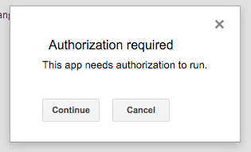

# Google App Script

## Documentation

You can directly go to the [landing page](https://developers.google.com/apps-script/?hl=en). Then you can find to important parts:
- [References](https://developers.google.com/apps-script/reference/) : This is the API
- [Guides](https://developers.google.com/apps-script/overview) : Tutorials 

## First code - Javascript

You have two options.

- First option. Open a Google Doc (Spreadsheet, Doc or Slides), `Tools > Script Editor`. This will be a Google App Script Project linked to this document.

- Second option. Once inside Google Drive create a Google App Script file. Before you'll need to install Google App Script application. It's easy. `New > More > Connect` more apps. Search "Google App Script" and install it. After that you can create files with `New > More > Google App Script`.  

## Debug 

Let's use the second option to create a GAP inside a Google Spreadsheet (second option).

You will see below de menu (File, ... ) a bunch of buttons. We'll use `Play` and the `Select Box` where you'll find all the functions in the file. `Play` will execute the function selected in the `Select Box`. 

Instead of using ``console.log(...)`` you can create a Log using ``Logger.log()``. You can see the result going to ``View > Logs``.  

```javascript
function myFunction() {
  Logger.log("Hi, world");
}
```

## Menu

More information [here](https://developers.google.com/apps-script/guides/menus) in the guide. 

```javascript
var ui = SpreadsheetApp.getUi();
  ui.createMenu("Personal Tools").
  	addItem("First item","myFunction").
  	addToUi();
```	

Useful functions: 

* ``addItem("Name", "functionName")``
* ``addSeparator()``
* ``addSubMenu(ui.createMenu())``


## Triggers 

Try to change the function name we have created for menu's. Use ``onOpen`` to create a trigger. You can see more triggers [here](https://developers.google.com/apps-script/guides/triggers/). 

You can access to your triggers (inside your GAP file) going to  ``Resources > Current Project's Triggers``.

## Authorization

Each time you call some function with special read/write permissions, it'll prompt a message like this: 

 

And then a list of all the features you're allowing. After accept it, you'll have to run again the script. 

## SpreadsheetApp

Let's see some of the main functions. All this classes have a hierarchy like this:

```
SpreadsheetApp
|- Spreadsheet
	|- Sheet
		|- Range
```

Let's use [this table](https://docs.google.com/spreadsheets/d/106yf8hGzn6X4KUjclueXAdFd87HlMVwQ1EMb6mfIxxQ/edit?usp=sharing) as a demo.

We have a lot of different ways to access the same data. Here some: 

``SpreadsheetApp.getActiveRange().getValues();``

```javascript 
var numberOfRows   = SpreadsheetApp.getActiveSheet().getLastRow();
var numberOfColumns = SpreadsheetApp.getActiveSheet().getLastColumn();
var values = SpreadsheetApp.getActiveSheet().getRange(1, 1, numberOfRows, numberOfColumns).getValues();
```

``SpreadsheetApp.getActiveSheet().getRange("namesAndEmails").getValues();``

### Other Apps

As an example we're going to use GmailApp to send us some emails:

```javascript
var values = SpreadsheetApp.getActiveSheet().getRange("namesAndEmails").getValues();
var emailText  = "Hi {{Name}}! How is it going?"; 

for (var i = 1; i < 3; i++) {
  var name = values[i][0];
  var email = values[i][1];
  GmailApp.sendEmail(email, "Probando cosas", emailText.replace("{{Name}}",name));
}
```

### More

* [DriveApp](https://developers.google.com/apps-script/reference/drive/drive-app) - Create, find, and modify files and folders in Google Drive.
* [CalendarApp](https://developers.google.com/apps-script/reference/calendar/calendar-app) -  Read and update the user's Google Calendar
* [Create and Serve HTML](https://developers.google.com/apps-script/guides/html/)

## More level/time

* [JDBC](https://developers.google.com/apps-script/reference/jdbc/)
* [Add-ons](https://developers.google.com/apps-script/add-ons/)
* [Libraries/Verisons](https://developers.google.com/apps-script/guide_libraries)
* [Advanced Google Services](Advanced Google Services)
